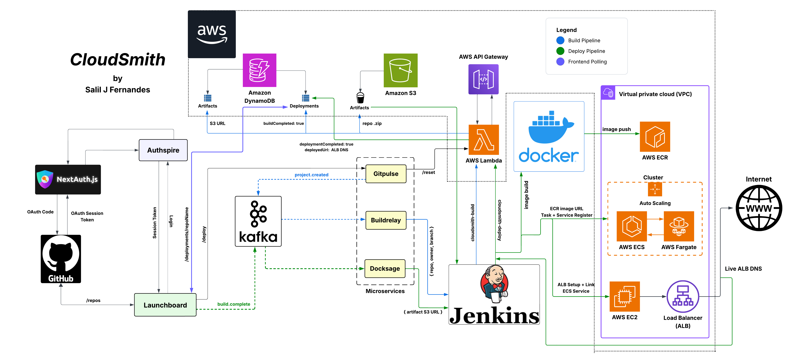

# CloudSmith  ☁️🚀
> Built with ❤️ by Salil Fernandes
### **A Cloud-Native Deployment Platform for One-Click Web App Deployments**

CloudSmith is a developer-centric CI/CD platform that lets you deploy web apps directly from GitHub with a single click.  
It is my version of a minimalist **PaaS** offering inspired by Vercel, Heroku from Salesforce, Netlify and Hostinger.

## 📌 Highlights

- Hands-on experience with scalable cloud architecture  
- Focus on automation, reliability, and clean developer experience  
- Full-stack engineering across frontend, backend, DevOps, and cloud  

I decided to develop CloudSmith to showcase end-to-end ownership of a real-world CI/CD system — from OAuth authentication to production deployment. I also wanted to reinforce my skillset in cloud infrastructure, microservices, distributed systems and DevOps best practices.

## 🎥 In Action

## 💡💫 Features

- **GitHub OAuth**: Secure public repo access integration via GitHub login  
- **Repo Picker**: Modern UI to select repositories for deployment  
- **CI/CD Pipeline**: Jenkins and Groovy pipelines for build and deployment  
- **Event-Driven Architecture**: Kafka powered inter-service communication  
- **Infrastructure-as-Code**: Terraform managed AWS cloud services 
- **Microservices**: Auth, Launch, Pipeline, Build, Deploy  

## ⚙️🛠️ Tech Stack

**Frontend**: Next.js, TypeScript, Tailwind CSS, Chakra UI, NextAuth.js (OAuth)  
**Backend**: Node.js, AWS Lambda, Jenkins  
**Microservices**: Kafka-driven services (Gitpulse, Buildrelay, Docksage)  
**Message Queue / Streaming**: Apache Kafka  
**Storage**: Amazon S3  
**Database**: Amazon DynamoDB  
**Containerization**: Docker  
**Container Orchestration**: AWS ECS (Fargate + EC2)  
**CI/CD**: Jenkins  
**Infrastructure as Code**: Terraform  
**Cloud Provider**: AWS Amazon Web Services
**Inter-service Communication**: Kafka Events  
**Auto-scaling**: ECS Cluster Auto Scaling (Fargate)  

## 📷 Architecture Diagram

## 📦🏛️ Architecture Overview

- **Authspire** – Manages GitHub OAuth and session validation  
- **Launchboard** – UI for repo selection and deployment triggers  
- **Gitpulse, Buildrelay, Docksage** – Kafka-driven microservices for orchestrating builds and deployments  
- **Jenkins** – Builds and uploads repo artifacts to S3  
- **AWS Lambda** – Triggers containerization and service registration  
- **Docker + ECR + ECS/Fargate** – Builds, pushes, and deploys containers at scale  
- **DynamoDB + S3** – Tracks deployment state and stores build artifacts  
- **Application Load Balance ALB** – Exposes live deployed apps via DNS

## 🌀♻️ Auto-scaling

CloudSmith ensures efficient, demand-based scalability across its deployment infrastructure:

- **Amazon ECS Auto Scaling**: Services deployed via **AWS Fargate** automatically scale based on CPU and memory utilization, ensuring consistent performance under varying loads without manual intervention.  
- **Jenkins Load Management**: Build workloads are processed asynchronously and decoupled via Kafka, preventing bottlenecks during burst traffic.  
- **Kafka-Driven Microservices**: Gitpulse, Buildrelay, and Docksage consume events independently, allowing them to scale horizontally based on topic traffic and system demand.

## 🌱 Future Work & Potential Improvements

- **Real-time Log Streaming**: Integrate WebSocket-based log streaming from Jenkins and ECS/EKS pods to the frontend for live build/deploy feedback.
- **Deployment Rollbacks**: Implement one-click rollback to previous ECS/EKS service versions in case of failed or unstable deployments.
- **EKS Support**: Extend deployment support to Kubernetes via Amazon EKS, enabling Helm-based deployments and KEDA-driven autoscaling for container workloads.
- **Multi-Cloud Support**: Expand CloudSmith to support GCP and Azure, making it a cloud-agnostic deployment platform.
- **Custom Domain Management**: Allow users to attach custom domains with automatic TLS via AWS Certificate Manager.
- **Secret Management**: Integrate AWS Secrets Manager or HashiCorp Vault to securely manage deployment secrets.
- **GitHub Actions Integration**: Support GitHub Actions as an alternative to Jenkins for CI.
- **Multi-Environment Deployments**: Enable staging/production environments with isolated pipelines, namespaces, and ALBs.
- **Metrics Dashboard**: Add Prometheus + Grafana dashboards to monitor build status, deploy latency, and service health.
- **Access Control**: Implement Role-Based Access Control (RBAC) for team-level permissions.

